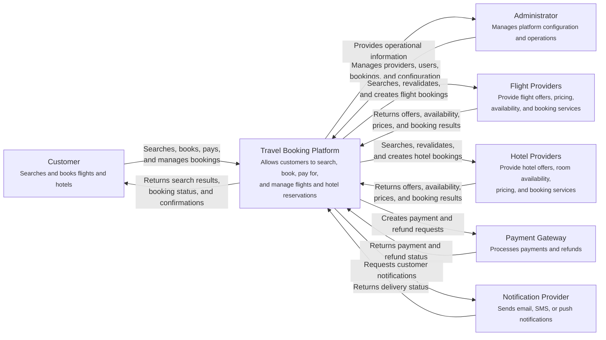

```mermaid
flowchart LR
    Customer["Customer<br/><small>Searches and books flights and hotels</small>"]
    Admin["Administrator<br/><small>Manages platform configuration and operations</small>"]

    Platform["Travel Booking Platform<br/><small>Allows customers to search, book, pay for,<br/>and manage flights and hotel reservations</small>"]

    FlightProviders["Flight Providers<br/><small>Provide flight offers, pricing,<br/>availability, and booking services</small>"]

    HotelProviders["Hotel Providers<br/><small>Provide hotel offers, room availability,<br/>pricing, and booking services</small>"]

    PaymentGateway["Payment Gateway<br/><small>Processes payments and refunds</small>"]

    NotificationProvider["Notification Provider<br/><small>Sends email, SMS, or push notifications</small>"]

    Customer -->|"Searches, books, pays,<br/>and manages bookings"| Platform
    Platform -->|"Returns search results,<br/>booking status, and confirmations"| Customer

    Admin -->|"Manages providers, users,<br/>bookings, and configuration"| Platform
    Platform -->|"Provides operational information"| Admin

    Platform -->|"Searches, revalidates,<br/>and creates flight bookings"| FlightProviders
    FlightProviders -->|"Returns offers, availability,<br/>prices, and booking results"| Platform

    Platform -->|"Searches, revalidates,<br/>and creates hotel bookings"| HotelProviders
    HotelProviders -->|"Returns offers, availability,<br/>prices, and booking results"| Platform

    Platform -->|"Creates payment and refund requests"| PaymentGateway
    PaymentGateway -->|"Returns payment and refund status"| Platform

    Platform -->|"Requests customer notifications"| NotificationProvider
    NotificationProvider -->|"Returns delivery status"| Platform
```