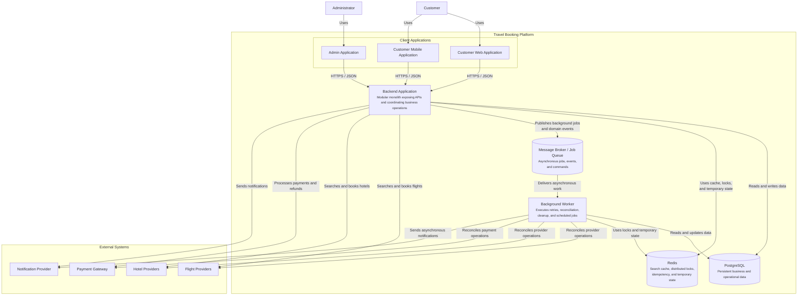

# 02. Container Diagram

## 1. Purpose

This document presents the C4 Level 2 Container Diagram for the Travel Booking Platform.

It shows the major deployable and executable parts of the platform, their responsibilities, the main communication paths between them, and the external systems they depend on.

This diagram describes the platform at the container level. It does not describe internal classes, functions, modules, or implementation details inside each container.

---

## 2. Platform Containers

### Customer Applications

The customer-facing applications allow users to:

- Register and authenticate.
- Search for flights and hotels.
- Review travel offers.
- Create and pay for bookings.
- Manage bookings, cancellations, and refunds.
- Receive booking and payment updates.

The customer experience may be delivered through:

- Web application.
- Mobile application.

### Admin Application

The admin application allows authorized administrators to:

- Manage users and roles.
- Manage external providers.
- Monitor bookings and payments.
- Configure supported business settings.
- Review operational and audit information.

### Backend API

The Backend API is the main entry point for client applications.

It is responsible for:

- Authentication and authorization.
- Request validation.
- Exposing business capabilities through APIs.
- Coordinating search, booking, payment, and notification operations.
- Returning normalized responses to client applications.

### Backend Application

The Backend Application is the primary server-side container of the platform.

It is implemented as a **Modular Monolith**, exposing APIs to client applications while maintaining clear internal module boundaries.

Its primary responsibilities include:

- Authentication and authorization.
- Request validation.
- Business workflow coordination.
- Integration with external providers.
- Persistent data management.
- Asynchronous job publishing.
- Response normalization.

The Backend Application contains several internal business modules, including:

- Authentication Module
- Customer Module
- Traveler Module
- Search Module
- Booking Module
- Payment Module
- Notification Module
- Administration Module
- Provider Integration Module

The internal structure of the Backend Application is documented in **03-backend-component-diagram.md**.

### Background Workers

Background Workers execute asynchronous and delayed operations such as:

- Booking status reconciliation.
- Payment status reconciliation.
- Notification delivery.
- Retryable provider operations.
- Expiration and cleanup tasks.

### PostgreSQL Database

PostgreSQL stores persistent platform data, including:

- Users and roles.
- Customer and traveler profiles.
- Bookings.
- Payments and refunds.
- Provider configuration.
- Audit records.
- Operational state.

### Redis Cache

Redis supports temporary and performance-sensitive data, including:

- Cached search results.
- Temporary offer references.
- Session or token-related data where applicable.
- Distributed locks.
- Idempotency records.
- Short-lived orchestration state.

Detailed caching decisions are documented in `10-caching-strategy.md`.

### Message Broker

The Message Broker enables reliable asynchronous communication between services and workers.

It may carry events and commands related to:

- Booking status changes.
- Payment updates.
- Notification requests.
- Retry operations.
- Reconciliation tasks.

The exact broker technology is an implementation decision and is intentionally not fixed in this diagram.

---

## 3. External Systems

The platform communicates with the following external systems:

- Flight Providers.
- Hotel Providers.
- Payment Gateway.
- Notification Provider.

These systems are outside the platform boundary and are documented at a high level in `01-system-context.md`.

---

## 4. Container Diagram



---

## 5. Main Communication Flows

### Customer Request Flow

```text
Customer Application
        ↓
Backend Application
        ↓
Business Module
        ↓
Database, Cache, or External Provider
```

The Backend API remains the public entry point for customer and administrator applications.

### Search Flow

```text
Customer Application
        ↓
Backend Application
        ↓
Business Module
        ↓
Database, Cache, or External Provider
```

The Search Service owns search aggregation and normalization. It does not create bookings.

### Booking Flow

```text
Customer Application
        ↓
Backend Application
        ↓
Business Module
        ↓
        ↓
PostgreSQL
```

The Booking Service owns booking state and booking coordination.

### Payment Flow

```text
Customer Application
        ↓
Backend API
        ↓
Payment Service
        ↓
Payment Gateway
        ↓
PostgreSQL
```

The Payment Service owns payment and refund state.

### Asynchronous Flow

```text
Business Service
        ↓
Message Broker
        ↓
Background Worker or Notification Service
```

Asynchronous communication is used for work that does not need to complete inside the original customer request.

---

## 6. Container Responsibilities

| Container | Primary Responsibility |
|---|---|
| Customer Web Application | Browser-based customer experience. |
| Customer Mobile Application | Mobile customer experience. |
| Admin Application | Administrative and operational management. |
| Backend Application | Hosts all business modules and exposes platform APIs. |
| Background Workers | Retryable, scheduled, and reconciliation work. |
| PostgreSQL | Persistent source of truth for platform data. |
| Redis | Cache, locks, idempotency, and temporary state. |
| Message Broker | Reliable asynchronous communication. |

---

## 7. Architectural Boundaries

### Search and Booking Separation

Search and booking are represented as separate responsibilities because they have different characteristics:

- Search is read-heavy and aggregation-oriented.
- Booking is stateful and consistency-sensitive.
- Search results are temporary.
- Booking records are persistent.
- Search may tolerate partial provider results.
- Booking requires a clear final business state.

### Booking and Payment Separation

Booking and payment are separate responsibilities because:

- A payment may succeed while provider confirmation is still pending.
- A booking may require compensation or reconciliation.
- Refund state is different from cancellation state.
- Payment provider events may arrive asynchronously.

### Persistent and Temporary Data

PostgreSQL is the persistent system of record.

Redis is not the source of truth for confirmed bookings or completed payments. It is used for short-lived and performance-sensitive state.

### Synchronous and Asynchronous Work

Operations required to respond to the current customer request may be synchronous.

Operations such as notifications, retries, reconciliation, and cleanup should be handled asynchronously where appropriate.

---

## 8. What This Diagram Does Not Define

This diagram does not decide:

- The internal implementation of the Backend Application.

    Its internal modules and their interactions are documented separately in the Backend Component Diagram.
- Which programming language or framework is used.
- Which message broker technology is selected.
- Which cloud provider hosts the platform.
- The exact database schema.
- The internal classes or modules inside each service.
- The exact API endpoints.
- Retry counts, timeouts, or circuit-breaker configuration.
- Security implementation details.

These decisions belong in their corresponding architecture and implementation documents.

---

## 9. Suggested MVP Deployment

For the MVP, the logical containers in this diagram do not have to be deployed as independent microservices.

A practical first implementation may use:

- One customer application.
- One admin application.
- One modular backend application.
- One background worker process.
- PostgreSQL.
- Redis.
- An optional message broker where asynchronous reliability is required.

The backend may contain Search, Booking, Payment, and Notification as internal modules while preserving the boundaries defined in this document.

This approach reduces operational complexity without losing architectural separation.

---

## 10. Related Documents

- `01-system-context.md`
- `04-functional-requirements.md`
- `05-non-functional-requirements.md`
- `08-search-architecture.md`
- `09-booking-orchestration.md`
- `10-caching-strategy.md`
- `11-database-design.md`
- `12-api-design.md`
- `13-failure-scenarios.md`
- `14-security.md`
- `15-observability.md`

---

## 11. Summary

This diagram presents the deployable containers of the Travel Booking Platform and the communication paths between them.

The Backend Application is implemented as a Modular Monolith, while its internal modules are documented separately in the Backend Component Diagram.

This separation keeps the Container Diagram focused on deployment boundaries while allowing the internal architecture to evolve independently.