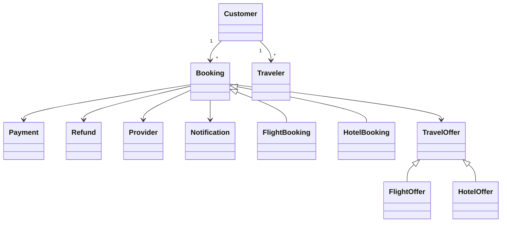

# 07. Domain Model

## 1. Purpose

This document describes the core business concepts of the Travel Booking Platform.

The Domain Model defines the primary business entities, value objects, and their relationships without describing database tables or implementation details.

It provides a common language for product owners, developers, architects, and QA engineers.

---

## 2. Business Constraints

The following business constraints influence the domain model:

- Search results are not guaranteed until revalidated.
- Every booking must originate from a valid travel offer.
- Flight bookings and hotel bookings have independent business lifecycles.
- Payment status is independent from booking status.
- Cancellation eligibility depends on provider policy.
- Refund eligibility is evaluated independently from cancellation.
- Historical booking information must remain immutable after confirmation.

---

# 3. Core Domain Concepts

## Customer

Represents the platform user who searches for travel products and creates bookings.

Responsibilities:

- Manage personal profile.
- Save traveler profiles.
- Create bookings.
- View booking history.
- Manage payment preferences.

---

## Traveler

Represents an individual traveling under a booking.

A traveler may or may not be the customer.

Examples:

- The customer themselves.
- Family members.
- Friends.

---

## Travel Offer

Represents a normalized offer returned from an external provider.

Characteristics:

- Temporary.
- Search result only.
- Not guaranteed.
- Must be revalidated before booking.

An offer may represent:

- Flight Offer
- Hotel Offer

---

## Flight Offer

Represents a flight itinerary returned by a provider.

Contains information such as:

- Segments
- Airline
- Fare
- Cabin
- Price
- Baggage
- Fare Rules

---

## Hotel Offer

Represents a hotel stay returned by a provider.

Contains:

- Hotel
- Room
- Rate Plan
- Occupancy
- Check-in
- Check-out
- Price
- Cancellation Policy

---

## Booking

Represents a confirmed reservation created from a travel offer.

A booking records:

- Accepted price
- Travelers
- Provider reference
- Current lifecycle
- Payment information

---

## Flight Booking

Represents a confirmed flight reservation.

Additional concepts include:

- Flight segments
- Ticket information
- Fare rules
- Airline confirmation

---

## Hotel Booking

Represents a confirmed hotel reservation.

Additional concepts include:

- Rooms
- Guests
- Rate plan
- Hotel confirmation

---

## Payment

Represents a financial transaction related to a booking.

Payment lifecycle is independent from booking lifecycle.

---

## Refund

Represents money returned after a successful cancellation or adjustment.

---

## Provider

Represents an external travel supplier.

Examples include:

- Flight providers
- Hotel providers
- Payment gateways
- Notification providers

---

## Notification

Represents a business event delivered to the customer.

Examples:

- Booking confirmed
- Payment failed
- Refund completed

---

# 4. Domain Relationships

---

# 5. Aggregate Boundaries

## Customer Aggregate

Root:

- Customer

Contains:

- Traveler Profiles

---

## Booking Aggregate

Root:

- Booking

Contains:

- Travelers
- Payment Reference
- Provider Reference

Specializations:

- Flight Booking
- Hotel Booking

---

## Payment Aggregate

Root:

- Payment

Contains:

- Payment Transactions
- Refunds

---

# 6. Value Objects

Examples include:

- Money
- Date Range
- Flight Segment
- Cabin Class
- Fare Rules
- Room Occupancy
- Cancellation Policy
- Address
- Email
- Phone Number

Value Objects have no identity and are compared by value.

---

# 7. Domain Events

Typical business events include:

- SearchCompleted
- OfferSelected
- BookingCreated
- BookingConfirmed
- BookingCancelled
- PaymentSucceeded
- PaymentFailed
- RefundCompleted
- NotificationSent

---

# 8. Design Principles

The domain model follows these principles:

- High Cohesion
- Low Coupling
- Explicit Business Boundaries
- Provider Independence
- Separation of Business Concepts from Infrastructure
- Technology-Agnostic Design

---

# 9. Related Documents

- Functional Requirements
- System Context Diagram
- Container Diagram
- Backend Component Diagram
- Search Architecture
- Booking Orchestration
- Database Design

---

# 10. Summary

The Domain Model defines the core business language of the Travel Booking Platform.

It separates business concepts from implementation details and serves as the foundation for architecture, workflows, APIs, and database design.